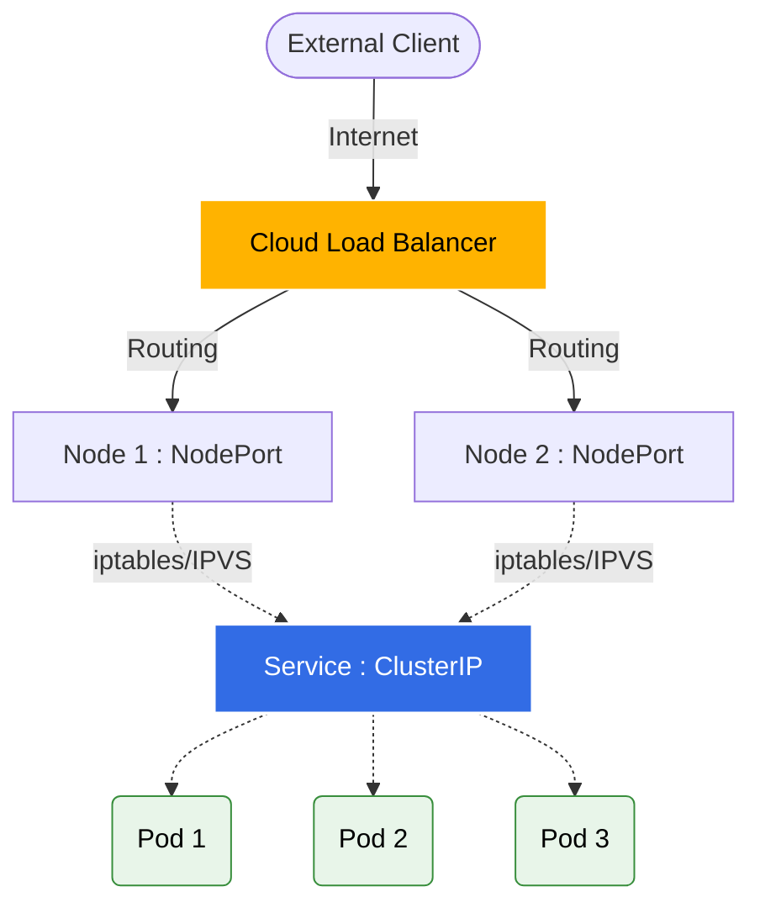

Pods 是不稳定的，一般不应该直接连 Pod ，而是通过 Service 来连接。本文介绍Kubernetes中各种类型的Service，以及它们的具体使用场景。

<!--more-->


## Service 类型

**Kubernetes Services** 是访问 Pods 的抽象层，为访问部署的应用程序提供了一个一致且简化的endpoint。在Kubernetes中有不同类型的Services，包括：`ClusterIP`, `NodePort`, `LoadBalancer`. 


### ClusterIP

`ClusterIP` 是Kubernetes中默认的Service类型，通过“**仅集群内可见的IP**”把部署在集群中的服务应用暴露出来。也就是说，这样的Service仅在集群内部可以访问。`ClusterIP` 非常适合于 <u>面向内部</u> 的 backend services，这些服务不应该暴露在集群外部。

**Example Configuration:**

```yaml
apiVersion: v1
kind: Service
metadata:
  name: my-internal-service
spec:
  type: ClusterIP
  selector:
    app: my-app
  ports:
    - protocol: TCP
      port: 80
      targetPort: 9376
```

### NodePort

NodePort Service 在每个Node的 IP 上通过一个静态端口（即 NodePort）暴露服务。这允许来自集群外部的外部流量通过 `<NodeIP>:<NodePort>` 访问服务。这种类型的服务一般适用于临时配置，如演示或开发环境。


**Example Configuration:**

```yaml
apiVersion: v1
kind: Service
metadata:
  name: my-nodeport-service
spec:
  type: NodePort
  selector:
    app: my-app
  ports:
    - protocol: TCP
      port: 80
      nodePort: 30007
```

### LoadBalancer

当在支持automatic load balancer provisioning的云服务提供商（AWS/GCP/Ali Cloud/TencentCloud等）的环境上运行时，LoadBalancer Service 会为你的Service配置一个负载均衡器（load balancer），**并将流量从外部负载均衡器 路由 到自动创建的 NodePort 和 ClusterIP 服务**。这种设置适合于生产环境，特别是需要将应用暴露到公网时。



**Example Configuration:**

```yaml
apiVersion: v1
kind: Service
metadata:
  name: my-loadbalancer-service
spec:
  type: LoadBalancer
  selector:
    app: my-app
  ports:
    - protocol: TCP
      port: 80
```

### ExternalName

ExternalName Service 是一种特殊 Service 类型，它没有Selector，也不管理任何Pods。相反，它使用DNS将流量重定向到外部服务。在 Service 的YAML配置中，通过 `externalName` 参数指向所需的外部DNS地址。

这种服务类型使得内部应用能够通过稳定的内部DNS入口访问外部资源，从而提高了系统的灵活性和可维护性，尤其是在迁移或外部服务变更时。所以，ExternalName 一般用于将**数据库、外部 API 和遗留系统**等服务直接整合到 Kubernetes Service 中的场景。

**Example Configuration:**

```yaml
apiVersion: v1
kind: Service
metadata:
  name: my-external-service
spec:
  type: ExternalName
  externalName: my.database.example.com
```

## Headless Service

如果每个通过 Service 的connection都随机到后端的一个 pod，那要是 client 想要连接每一个 pod 怎么办呢？它需要知道每一个 pod 的 IP。当然，我们可以通过调用 Kubernetes API Server 来获取到所有 pod 的 IP，但我们应该让应用保持Kubernetes-agnostic，所以这不是一个很理想的方法。

所以在 Kubernetes 中，我们可以通过 DNS lookups 来让 client 发现 pod IPs。通常情况下，当你通过DNS lookup来查询一个 Service，DNS Server 会返回一个 IP—— Service 的 Cluster IP。但是，如果你告诉 Kubernetes 你不需要这个service的 IP（把 service 中的 `clusterIP` 字段设为 `None`），那么DNS Server 就会返回 pod IPs 而不是 service IP。也就是说，这时 Kubernetes 返回的是service 的多个 A 记录而不是单个 A 记录，每一个都分别指向后端每个 pod 的 IP。

这就是Headless Service，把 service 中的 `clusterIP` 字段设为 `None`，Kubernetes 就不会为service 分配 clusterIP，那么 client 可以直接连到 pod 的 IP。

那么 DNS 是如何自动地配置的呢？这取决于service 是否有设置selectors：

### With selectors

对于设置了 selectors 的 service，endpoint controller会在集群中创建`EndpointSlices` 资源，然后修改 DNS 配置来返回A or AAAA记录（IPv4 or IPv6地址），直接指向后端支撑服务的 Pods。

### Without selectors

没有 selectors 的话，control plane 不会创建EndpointSlice. 不过，DNS system 会配置以下之一：

- 对于`type: ExternalName` 的 Headless Service, 配置DNS CNAME记录
- 对于其他，配置DNS A / AAAA 记录（包括service 的所有ready 的 endpoints ）

## Discovering services

对于在 Kubernetes 集群中的应用，有两种主要的方式发现Service：环境变量 和 DNS。

### 环境变量

Pod 运行在 Node 上，而 Node 上的 Kubelet 会获取到所有在该 namespace 下的 active service 的信息，注入到 pod 的环境变量中，格式是`{SVCNAME}_SERVICE_HOST` 和 `{SVCNAME}_SERVICE_PORT`。 

```bash
root@pdb-dp-857c7ff884-m7nkd:/# env|grep SERVICE
KUBERNETES_SERVICE_PORT_HTTPS=443
KUBERNETES_SERVICE_PORT=443
KUBERNETES_SERVICE_HOST=10.96.0.1
```

> 📢：如果 pod 是在创建 Service 前创建的，那么不会注入 Service 相关的环境变量信息。

### DNS

正常集群中都会部署一个cluster-aware的 DNS service 插件，例如 CoreDNS。CoreDNS 持续监听 Kubernetes API 来发现新的 Services，为它们创建 DNS 记录。


## Virtual IP addressing mechanism

以上内容介绍了 Kubernetes Service 的基本使用方法和场景，现在介绍的是 Service 的 Virtual IP 是如何实现的😄

### Traffic policies

Kubernetes 提供了路由流量的策略，主要分为 `externalTrafficPolicy` 和 `internalTrafficPolicy`：

- **`externalTrafficPolicy`**：控制来自外部的流量（如 NodePort 或 LoadBalancer）如何路由。默认值为 `Cluster`，流量可能会被路由到集群中任意节点上的 Pod，这会导致额外的网络跳数（SNAT）。如果设置为 `Local`，则流量只会路由到接收流量的当前节点上的 Pod，从而保留客户端源 IP 并减少网络跳数，但可能导致流量分配不均。
- **`internalTrafficPolicy`**：控制集群内部流量的路由。默认值为 `Cluster`，流量随机分配给所有可用的 endpoints。如果设置为 `Local`，kube-proxy 会优先将流量路由到与客户端处于同一节点上的 endpoints，如果当前节点没有可用的 endpoints，则丢弃流量。

### Session stickiness

默认情况下，Service 的请求会被随机负载均衡到后端的各个 Pod 上。但如果你需要来自特定客户端 IP 的所有请求每次都连接到同一个 Pod，你可以配置会话保持（Session Stickiness）。

可以通过将 `sessionAffinity` 设置为 `ClientIP` 来实现基于客户端 IP 的会话亲和性。还可以通过 `sessionAffinityConfig.clientIP.timeoutSeconds` 来配置会话保持的最大时间（默认为 10800 秒，即 3 小时）。

```yaml
apiVersion: v1
kind: Service
spec:
  sessionAffinity: ClientIP
  sessionAffinityConfig:
    clientIP:
      timeoutSeconds: 10800
```

## External IPs 

如果存在路由到一个或多个集群节点的外部 IP 地址，Kubernetes Service 可以暴露在这些 `externalIPs` 上。当网络流量进入集群时，如果目标 IP 是 Service 的外部 IP，且目标端口与 Service 端口匹配，流量就会被路由到该 Service 的某个 endpoint 上。

`externalIPs` 不由 Kubernetes 管理，集群管理员需要自己配置网络路由以确保流量能够到达集群节点。

```yaml
apiVersion: v1
kind: Service
spec:
  selector:
    app: my-app
  ports:
    - name: http
      protocol: TCP
      port: 80
      targetPort: 9376
  externalIPs:
    - 80.11.12.10
```

## 其他

### Services without selectors

Service 通常用于抽象访问 Kubernetes Pods，但它们也可以用于抽象其他类型的后端。例如：
- 希望在生产环境中使用外部数据库集群，但在测试环境中使用自己的数据库。
- 希望将 Service 指向另一个 Namespace 或其他集群中的 Service。
- 正在将工作负载迁移到 Kubernetes，目前只有一部分后端运行在 Kubernetes 中。

在这些场景下，可以定义一个不带 selector 的 Service，然后手动创建一个 `EndpointSlice`（或 `Endpoints`）对象，将其映射到指定的后端 IP 和端口。

### EndpointSlices and Endpoints

- **Endpoints**：是 Kubernetes 早期用于映射 Service 到 Pod IP 的 API 资源。由于所有的后端 IP 都存储在一个单一的 Endpoints 对象中，当 Service 后端拥有大量 Pod 时，该对象会变得非常大，导致性能和可扩展性问题。
- **EndpointSlices**：为了解决 Endpoints 的扩展性问题，Kubernetes 引入了 EndpointSlices。它将一个 Service 的网络端点“切片”成多个资源，每个 EndpointSlice 默认最多包含 100 个端点。这极大地减少了 kube-proxy 等组件在端点更新时需要处理的数据量，提升了大规模集群的性能。

## References

1. [Kubernetes Services 官方文档](https://kubernetes.io/docs/concepts/services-networking/service/)
2. [What is a Headless Service? (StackOverflow)](https://stackoverflow.com/questions/52707840/what-is-a-headless-service-what-does-it-do-accomplish-and-what-are-some-legiti)
3. [Kubernetes EndpointSlices 官方文档](https://kubernetes.io/docs/concepts/services-networking/endpoint-slices/)
